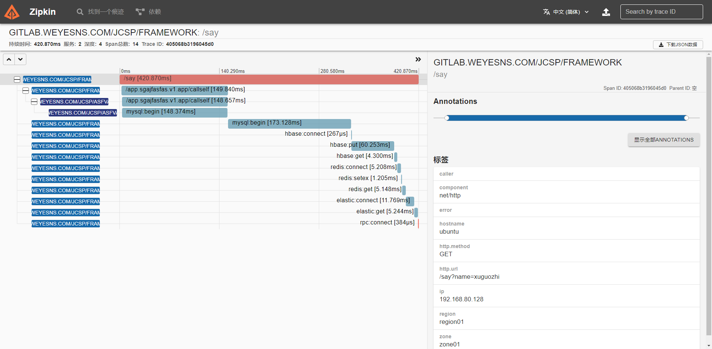

# micro server demo

## 项目简介

当前项目为微服务脚手架

## 使用说明

通讯容器：make bash  
拉取镜像建立容器：make build  
初始化脚手架：make init  
清除依赖：make clean  
依赖更新：make mod  
依赖检查：make tidy  
项目打包：make install  
编译proto协议：make proto  
编译依赖注入：make write  
运行脚手架：make run  
运行zipkin：make zipkin  
运行jaeger：make jaeger  

## 文档

[文档地址](./doc.md)

## 初始化脚手架

开发环境要求：docker  
wget -qO- https://get.docker.com/ | sh  

第一步：git clone -b v1.0.0 --depth=1 http://github.com/little-bit-shy/go-xgz.git  
第二步：cd go && make init
```shell
项目初始化
初始化过程中禁止中断
旧项目位置为/data
旧项目包名为github.com/little-bit-shy/go-xgz
当前文件夹为data
初始化项目包名（示例：github.com/little-bit-shy/go-xgz）: github.com/little-bit-shy/abc   
当前包名合法
开始重构项目...
go: creating new go.mod: module gitlab.weyesns.com/jcsp/abc
go: finding module for package github.com/olivere/elastic/v7
go: finding module for package github.com/go-playground/validator/v10
go: finding module for package github.com/shopspring/decimal
go: finding module for package github.com/google/wire
go: found github.com/google/wire in github.com/google/wire v0.5.0
go: found github.com/olivere/elastic/v7 in github.com/olivere/elastic/v7 v7.0.22
go: found github.com/shopspring/decimal in github.com/shopspring/decimal v1.2.0
go: found github.com/go-playground/validator/v10 in github.com/go-playground/validator/v10 v10.4.1
项目初始化完成
```
第三步：make run
```shell
[warden] config is Deprecated, argument will be ignored. please use -grpc flag or GRPC env to configure warden server.
```
第四步：curl http://127.0.0.1:8000/call_self?name=xuguozhi
```shell
{
    "code": 0,
    "message": "OK",
    "ttl": 1,
    "data": {
        "content": "who is xuguozhi"
    }
}
```
第五步：curl http://127.0.0.1:8000/say?name=xuguozhi
```shell
{
    "code":0,
    "message":"OK",
    "ttl":1,
    "data":{
        ......
    }
}
```
第六步：其他
```shell
curl http://127.0.0.1:8000/metadata
curl http://127.0.0.1:8000/debug/pprof
curl http://127.0.0.1:8000/metrics
```
第七步：链路跟踪  
浏览器打开：http://127.0.0.1:9411  
  
